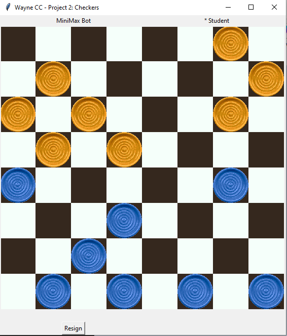
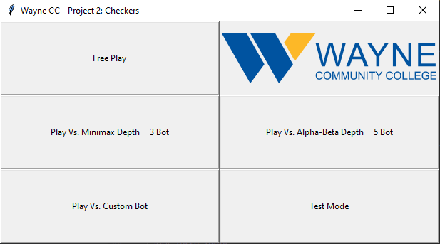

# Project 3: Adversarial Search - Checkers #

In this project, you will implement what you have learned in chapter 5 to create a Minimax and Alpha-Beta checkers bot. 

Read all of the following in detail before asking questions. After, feel free to ask as many questions as you need!

***
### Table of Contents

* [Introduction](#Introduction)
* [Supporting Functions](#Support)
* [Part 1: MiniMax](#Q1)
* [Part 2: Alpha-Beta](#Q2)
* [Part 3: Write-up](#P3)
* [Extra Credit: Custom-Bot Competition](#EC)

***

## Introduction ##

You will program the brains of a checkers bot to play at a competitive level and will be able to play against it yourself! The minimax
and Alpha-Beta Algorithms will be implemented. The project includes a test mode to let you check the performance of your algorithms, but you will submit your work to Gradescope.

**The File you'll edit and submit:**

[`adversarial.py`](adversarial.py) - Contains all the functions you will complete

Do not edit any other files!

**The File you will want to look at:**

[`checkersBackend.py`](checkersBackend.py) - Pay attention to the getMoves and perform_action functions

### Checkers Rules

The rules used in this checkers game are standard. If you have the option to make a jump, you must take it. If you hve no more moves available or have no pieces left, you lose the game.

When playing against yourself, a friend, or your bots, you must first click on which piece to move and then click on the space to move to

### Main Menu

The following menu will appear when you run the project (see "Run" at bottom)

**Free Play** - Play as both player 1 and 2 to get a feel for the enviroment and rules

**Play Vs. MiniMax** - Play against your minimax bot, you must first work on the functions for this to work

**Play Vs. AlphaBeta** - Play against your AlphaBeta bot, you must first work on the functions for this to work

**Play Vs. Custom** - Play against your Custom bot, you must first work on the functions for this to work

**Test Mode** - Test your implementations. Clicking this button will run the tests. After a short time you will see your results printed to the terminal. This will report how many games out of 20 your bots have won. See grading below.

## Supporting Functions

Before you can get your Minimax and Alpha-Beta bots to work, you must first complete the following Supporting functions:

**evaluate_board**: Because you can't search the whole tree of possible moves, you will at some point have to evaluate a board state as it is. This is where you can really get creative and 
apply your knowledge of checkers to generate a score for a board. A simple example is to count the number of pieces your bot has left and give that as a score.

**isGameEnd**: This is a simple function in which you will need to output whether a board state is at end game with player 1 or 2 winning, or not an end game as a 0, 1, or -1 respectively. You can do this easily by checking whether each player has any available moves (getMoves function helps)

## Part 1: Minimax (50 points)

In this part of the project, you will complete the minimax algorithm. This includes 3 functions: minimax, max_value, and min_value. All of these must be complete and work together for your implementation to work. See the function documentation in adversarial.py for a detailed explanation.

The following will determine your grade, out of 20 games:

**16 games won**: 40/50 points

**17 or greater games won**: 50/50 points

## Part 2: Alpha-Beta (30 points)

In this part of the project, you will complete the Alpha-Beta algorithm. This includes 3 functions: alpha_beta, ab_max_value, and ab_min_value. All of these must be complete and work together for your implementation to work. See the function documentation in adversarial.py for a detailed explanation.

The following will determine your grade, out of 20 games:

**17 games won**: 25/30 points

**18 games won**: 27/30 points

**19 or 20 games won**: 30/30 points

## Part 3: Write-up (20 points)

For full credit, you will write up (around a page and in your own words) an explanation of your evaluation function and how your algorithms work. Why is your evaluation function good for checkers and how are your Minimax and Alpha-Beta bots producing a good move choice?

## Extra-Credit:

A week after the project is due, you will have the opportunity to submit a custom bot that goes beyond what is covered in this project, or includes a very effective evaluation function. Your bot will compete against the bots of other students in the class in a single elimination format. The winner and 2nd place finisher will receive extra credit. There are several things you can do to improve your bots including (random) move ordering and iterative deepening. Each move will have a 1 second time limit. 

Each round will include 5 games. Draws will result in both players being eliminated, so try to include some randomness in your move choices.  
## Submission ##

You will submit your adversarial.py file to Gradescope. Be sure not to edit any other files during your work as this could cause you to fail testing. If your algorithms pass the Test Mode inside pycharm, they will pass the Gradescope tests.

You will get 5 submissions to Gradescope, so use them wisely. The best grade for each part will be kept. 

Submit your Write-up to the Moodle activity for this project.

**Be sure to comment your code!, you will recieve points off for poor or no comments**
## Requirements ##

### Python 3 ###
    
You should already have python 3 running on your computer. If not already installed, you will need to install 

Pillow: 
    
    pip install Pillow

## Run ##
    
Run the following command in the pycharm or main terminal to run the program. The main menu will appear

    python checkers.py
