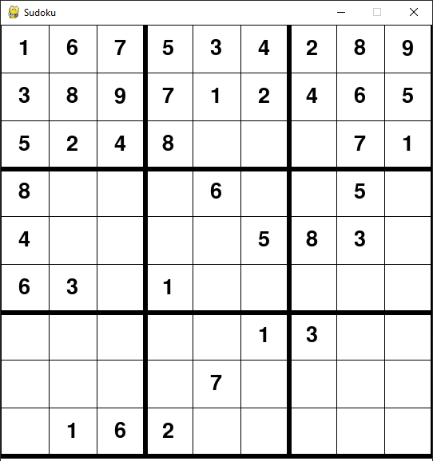
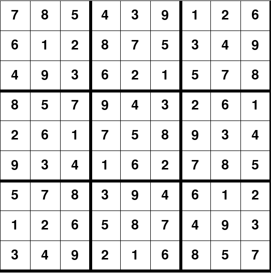
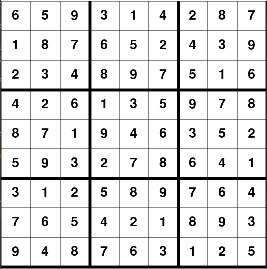
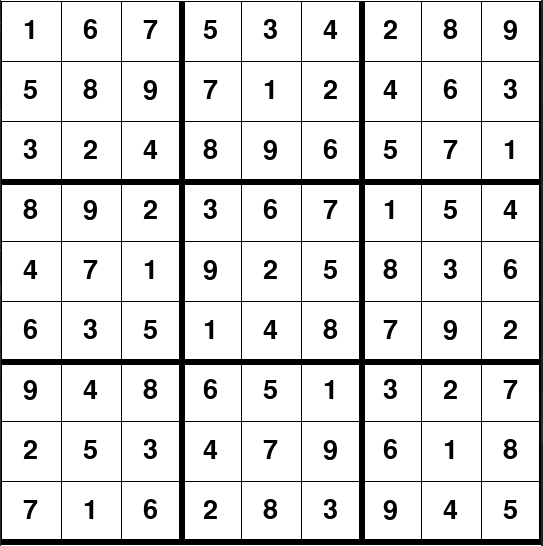

# Project 4: Backtracking Search - Sudoku

In this project, you will implement what you have learned in chapter 6 to create a Sudoku solver which you can use to solve any solvable Sudoku Puzzle 

As always, read all of the following in detail before asking questions. After, feel free to ask as many questions as you need!

***
### Table of Contents

* [Introduction](#Introduction)
* [Part 1: Backtracking Search](#Q1)
* [Part 2: Backtracking Search Visualized](#Q2)
* [Part 3: Write-up](#P3)

***

## Introduction ##

In this project you will implement the backtracking search algorithm you have learned about to solve Sudoku Puzzles. 

**Files you'll edit and submit:**

[`game.py`](game.py) - Contains the main backtracking algorithm you will implement

[`visual.py`](visual.py) - Contains code for the visual backtracking implementation you will also implement

**The file you may want to look at (Don't edit!):**

[`puzzle.py`](puzzle.py) - Contains supporting code for the visual pygame Sudoku solver

## Sudoku

Sudoku is a logic-based, combinatorial number-placement puzzle. It  is one of the most popular puzzle games of all time. The objective is to fill a 9 × 9 grid with digits so that each column, each row, and each of the nine 3 × 3 subgrids that compose the grid (also called "boxes", "blocks", or "regions") contain all digits from 1 to 9.
Puzzles start off as a partially filled grid and are filled in to achieve this objective.

The rules are thus that all numbers in each row must be different, in each column must be different, and in each 3x3 box.

3 Puzzles are provided to you, an easy, medium, and hard one. They are provided as a 2D array in which empty squares are represented with 0's. 

With a correct backtracking implementation, you can also type in other puzzles and have them solved.

## Part 1: Backtracking Search (70 points)

For the first part of the project, you will implement the backtracking algorithm in [`game.py`](game.py). The algorithm will return **True** if the puzzle has been solved and **False** otherwise. The algorithm will modify the board (2D array) passed to it.

You will need to complete 3 functions, the **backtrack** function, the **select_unassigned_variable** function as well as the **check_validity**.

The Solutions you should get are shown at the bottom of this readme. It is possible to get another solution for one of the puzzles but this should not occur if you complete the **select_unassigned_variable** as follows:

Search for an empty square from left to right, top to bottom. So, search the first row first from left to right, then the second row left to right and so on.

If you get another valid solution and your implementation is correct you will still get full credit.

Follow the pseudocode in figure 6.5 of your book. Note the following:
* You do not need the wrapper function
* Your domain values should be ordered 1-9
* You don't need to worry about the inference aspects
* The algorithm should return True or False
* The algorithm should modify the board (2D array) passed to it

The code at the bottom runs and displays the solution, You can alter it from board1 to other boards:
>     if __name__ == "__main__":
>         backtrack(board1)
>         show_board(board1)

Grading will be done on different boards than you are given.

## Part 2: Visualized Solver (10 points)

In this part of the project, you will simply modify your backtracking algorithm to work with pygame. You will thus be able to visualize your algorithm solving the puzzle.

You will need to complete the **backtrack** function in [`visual.py`](visual.py)

The Puzzle object in [`puzzle.py`](puzzle.py) will be used.

To get this to work you will need to do and take account of the following:
* First, copy over your backtracking imlementation into this new backtrack function
* You will working with a Puzzle object, not a 2D array as before!
* To get the 2D array from this puzzle object, call 
  * >     puzzle.get_board()
* To alter the board of the puzzle object, use the following:
  * >     puzzle.place(number, row, col)
* this backtrack algorithm takes in as params the puzzle object and the win object (a pygame window)
* call the following each time you edit the board with puzzle.place() to update the board visually:
  * >     redraw_window(win, puzzle)
    >     pygame.display.update()

You can alter which board is solved in the main() function at the following line (line #59):
>     board = Puzzle(board1)

With this working, you will be able to watch your puzzle being solved by the algorithm and can get a better idea of how it is working.

## Part 3: Write-up (10 points)

Simply Explain how your algorithm works as best you can in your own words. There is a limit of one page. This will be graded based on the quality of your explanation.

## Submission ##

Be sure not to edit the puzzle.py file.

Submit your Write-up, [`game.py`](game.py), and [`visual.py`](visual.py) files to the Moodle activity for this project.

Both the write-up and code will be checked for plagiarism.

## Requirements ##

### Python 3 ###
    
You should already have python 3 running on your computer. If not already installed, you will need to install 

### PyGame ###

You can install in the terminal with

> pip install pygame

## Run ##
    
Running the [`game.py`](game.py) will print the solved puzzle or "fail" otherwise

Running the [`visual.py`](visual.py) file will run the pygame interface which will bring up the visual puzzle being solved

## Solutions ##

**Board 1**:

**Board 2**

**Board 3**

