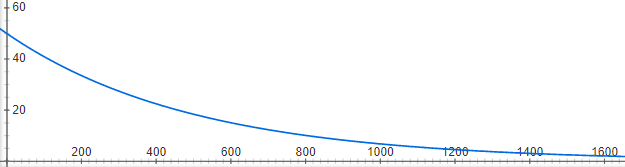

# Project 2: Optimization Search - Knapsack

In this project, you will implement what you have learned in chapter 4 to tackle the Knapsack Problem with Hill Climbing, Random Restart Hill Climbing, Simulated Annealing, and Genetic Algorithms. 

Read all of the following in detail before asking questions. After, feel free to ask as many questions as you need!

***
### Table of Contents

* [Introduction](#Introduction)
* [Part 1: Hill Climbing](#Q1)
* [Part 2: Simulated Annealing](#Q2)
* [Part 3: Genetic Algorithm](#Q3)
* [Part 4: Graph and Write-up](#P4)

***

## Introduction ##

In this project you will implement the optimization algorithms you have learned about to solve the Knapsack problem. it is important to realize that understanding an algorithm or technique requires more than reading about that algorithm or even implementing it. Exploring how these algorithms differ in similar circumstances will assist in this goal.

**The File you'll edit and submit:**

[`hill.py`](hill.py) - Contains all the functions you will complete for hill climbing

[`annealing.py`](annealing.py) - Contains all the functions you will complete for simulated annealing

[`genetic.py`](genetic.py) - Contains all the functions you will complete for the genetic algorithm

[`graph.py`](graph.py) - Contains all the functions you will complete for the genetic algorithm

Do not edit any other files!

**The File you will want to look at:**

[`knapsack.py`](knapsack.py) - Code for the knapsack problem

## The Knapsack Problem

The Knapsack problem is an optimization problem in which the goal is to maximize the total value of objects in your knapsack.
However, you have more items than you can fit in the knapsack, and so you must pick a subset of the items. Imagine your house is on fire and you want to carry out as many valuale things as you  can carry.

Each possible item to put in the knapsack has a weight and a dollar value. The fitness function or value you are trying to maximize is this total dollar value of all the items you fit in the knapsack. Your knapsack can only hold 140 pounds. 

The state of your knapsack is represented as a 'chromosome' of 1's and 0's. Each item of the array represents an individual item with 1's indicating the item is present in the knapsack and 0's indicating it is absent. So an empty knapsack would be represented in your code as:
> [0, 0, 0, 0, 0]

assuming there are 5 possible items that could be put in the sack. Your knapsack problem will include 30 possible items. 

If the knapsack contained items 1 and 3, it would look like the following:

> [1, 0, 1, 0, 0]

The knapsack will start off empty for the beginning each algorithm run. An empty or overweight knapsack is valued at $1 for the knapsack itself.

## Random Seed

These algorithms use a lot of randomness. To verify your implementations are working correctly, be sure not to change the random seed of 534. This seed insures your random selections are the same everytime and that you get the appropriate final answer.

## Grading 

Grading for each algorithm is based on if you got the right value. If you did not get this value you can still get partial credit, or even full credit if your implementation is technically correct. Your code will be checked regardless.

Grading for the write-up is based on the quality of your discussion. The graph itself is worth 5 points.

## Part 1: Hill Climbing (35 points)

For the first part of the project, you will implement the hill climbing algorithm. The algorithm will terminate when no better step can be taken. 

You will need to complete 2 functions, the **hill_climb** function as well as the **best_neighbor** function which finds the highest valued
neighbor of a current knapsack state.

Your result should be valued at **$203.**

## Part 2: Simulated Annealing (25 points)

For simulated Annealing, you will use starting temperature of 50, and an exponential decay rate of .998. This decay schedule is done for you and visually you can see the decay slows down over time:

You will need to complete the **sim_annealing** function, the **get_successor** function

**Note there is a typo in the pseudocode in Figure 4.5!** 

The line:

ΔE <- Value(current) - Value(next)

should be:

ΔE <- Value(next) - Value(current)

You should get a final result of **$211.**

## Part 3: The Genetic Algorithm (20 points)

For this algorithm, you will need to complete 5 functions: **reproduce, weighted_choice, mutate, generate_population, and genetic**. See these function comments for more explanation. A population size of 300 and a mutation rate of .01 is used. 

Your result should be valued at **$225.**, which is the optimal value.

## Part 4: Graph and Write-up (20 points)

Run the graph.py file once your implementations are complete to create a graph of your algorithms training iterations vs. results. It will be saved to Knapsack_graph.png. Include this graph in a write-up that explains these results and why each algorithm acted the way it did. Give a summary of how each algorithm works in your own words. You are limited to 2 pages.

If you do not complete all algorithms you can still produce a graph and write-up.

**Some things you should discuss:**

Why is hill-climbing so fast?

Why is Simulated annealing so slow?

Why was simulated annealing able to get a better value than hill-climbing?

Why did the genetic algorithm perform the best?

Why does the graph look the way it does?

## Submission ##

You will submit your files to Gradescope. Be sure not to edit any other files during your work as this could cause you to fail testing. If your algorithms pass the Test Mode inside pycharm, they will pass the Gradescope tests.

You will get 5 submissions to Gradescope, so use them wisely. The best grade for each part will be kept. 

Submit your Write-up to the Moodle activity for this project.

Both the write-up and code will be checked for plagerism.

## Requirements ##

### Python 3 ###
    
You should already have python 3 running on your computer. If not already installed, you will need to install 

### Numpy ###

You should already have numpy and matplotlib installed, but you can install them in the terminal with

> pip install numpy

> pip install matplotlib

## Run ##
    
Run each file independently to check the implementation of each. Run the graph.py file to run all algorithms. This will save the graph as a file in your directory which you can then include in your write-up.
